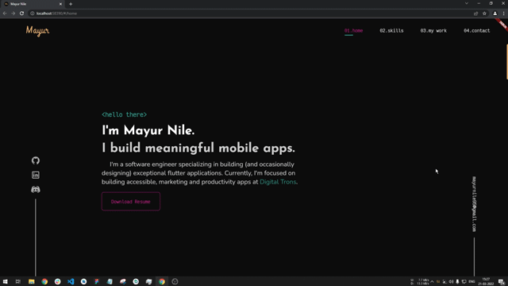
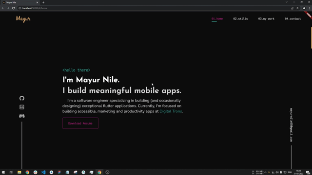

# Web Smooth Scroll

A package to help you provide a smoother and aesthetic scroll feeling. The motivation behind this package is, while using the official Flutter SDK the scrolling experience on web is very jerky and feels laggy to overcome it and provide more quality scrolling this package is developed.

<br>

## Motivation

While I was developing my portfolio website using Flutter I faced the issue of jerky scrolling so for a research in solving it I came across this package https://pub.dev/packages/smooth_scroll_web, but it has got some issues and currently not being maintained by the author. It has issues while scrolling and also when using with scrollbars the scroll behaviour is different. Also when user uses a trackpad to scroll it'll scroll to the bottom of the screen and makes the website completely unusable. Also that package doesn't supports null safety which is supported in this package. I've developed this package to overcome all this issues. I would like to thank Dezső Csete, for this motivation and providing a base to work on.

<br>

## Scroll without plugin

<!-- -->


<br>

## Scroll with plugin

<!--  -->


<br>

## Getting Started

- [Installation](#installation)
- [Basic Usage](#basic-usage)

<br>

### Installation

Add

```
dependencies:
  web_smooth_scroll: ^latest_version
```

to your `pubspec.yaml`, and run

```bash
flutter packages get
```

in your project's root directory.

### Basic Usage

 > 1. Import it to your project file
```dart
import 'package:web_smooth_scroll/web_smooth_scroll.dart';
```

 > 2. Create a Scroll Controller
```dart
  // Controllers
  late ScrollController _scrollController;

  @override
  void initState() {
    // initialize scroll controllers
    _scrollController = ScrollController();

    super.initState();
  }
```

 > 3. Use the controller with package
```dart
@override
  Widget build(BuildContext context) {
    return Scaffold(
      appBar: AppBar(
        title: const Text('Web Smooth Scroll'),
      ),
      body: WebSmoothScroll(
        controller: _scrollController,
        child: SingleChildScrollView(
          physics: const NeverScrollableScrollPhysics(),
          controller: _scrollController,
          child: _buildScrollableList(),
        ),
      ),
    );
  }
```

### `WebSmoothScroll` can be used with any scrollable widget, just pass the same scroll controller to `WebSmoothScroll` as well as the scrollable widget. And also specify scroll physics to `NeverScrollableScrollPhysics()`

<br>

 > There are additional optional parameters one can use
```dart
    WebSmoothScroll(
        controller: _scrollController,
        scrollOffset: 60, // additional offset to users scroll input
        animationDuration: 500, // duration of animation of scroll in milliseconds
        curve: Curves.easeInOutCirc, // curve of the animation
        child: SingleChildScrollView(
          physics: const NeverScrollableScrollPhysics(),
          controller: _scrollController,
          child: _buildScrollableList(),
        ),
    ),
```

## Some points to be noted
1. This plugin is to be used only on web and not on any other platform, you can check if platform is web and render using `WebSmoothScroll` else don't use this plugin.
2. Remember to assign physics as `NeverScrollableScrollPhysics()` else you won't see any change in the scrolling behaviour
